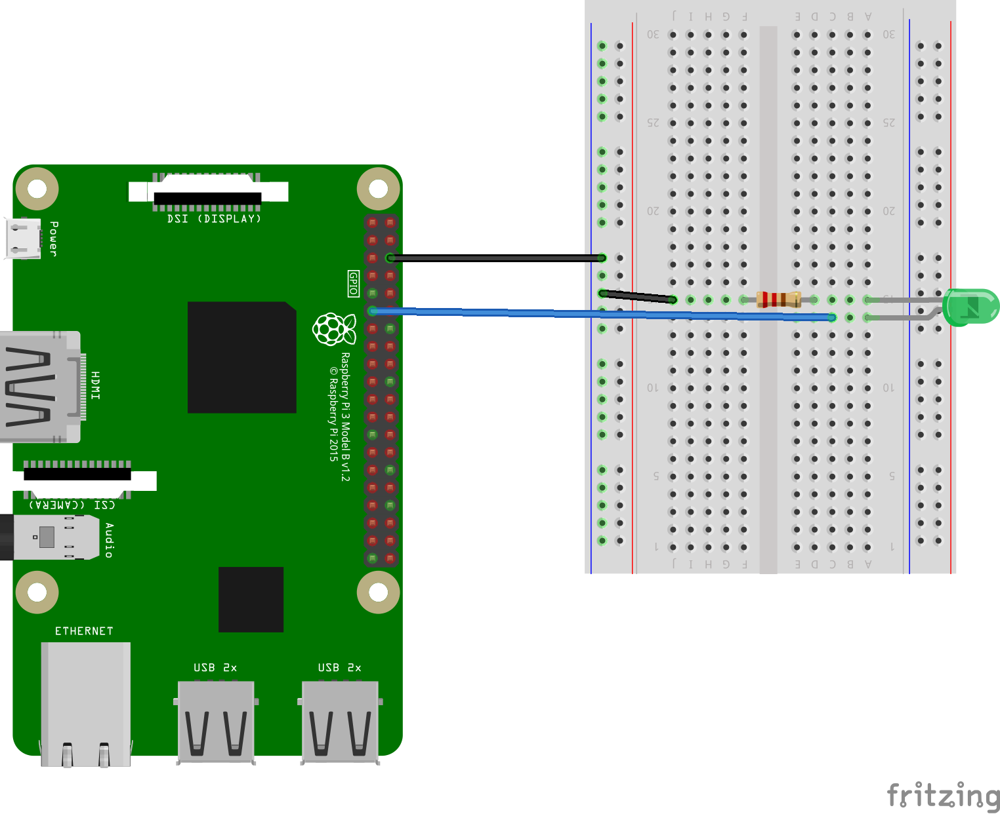
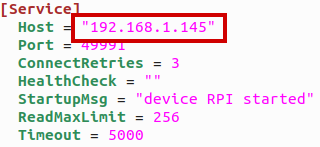
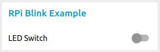

# Blink LED Example

## About
Example lighting control using an LED and Node-Red

## Hardware:
* 1 LED
* 2 220ohm resisters

## Configuration

Connect the LED as shown below.



* The LED should be connected to pin #11 on the Pi

## Running

### Start EdgeX

While you can run EdgeX on a RaspberryPi, due to it's limited resources it's best to run the EdgeX services on your PC or another computer.

Use the docker-compose.yaml file provided in this example project to launch an EdgeX stack

```
docker-compose -f ./examples/Blink/docker-compose.yaml up -d
```

This file also includes Node Red, which is used later in this example.

### Run the device service

Before running `device-rpi` for this example, you will need to change its `configuration.toml` to point to the
IP address of your RaspberryPi as well as the IP address of your running EdgeX services.

At the top of the file, replace the `Host` property with the IP address of your RaspberryPi



In the `[Clients]` section, update the `Host` properties for Data and Metadata with the IP address
of the machine running the EdgeX services you started in the first step.


Then you can start the `device-rpi` service using using the `Blink ` example:
```
./build/release/device-rpi --confdir ./examples/Blink
```

### Configure Node-Red

A Node-Red flow is provided for this example, you will need to load it into your instance.

1. Open http://localhost:1880/ on the the machine running your EdgeX services (or replace `localhost` with that machine's IP address)

2. Import the example Node-Red configuration by copy/pasting the provided `blinkr_flow.json` file into your instance:


3. Click the `Deploy` button at the top of your Node-Red screen to start your flow

## Testing

You will now have a Node-Red dashboard at http://localhost:1880/ui/ where you can control the LED on your board.




