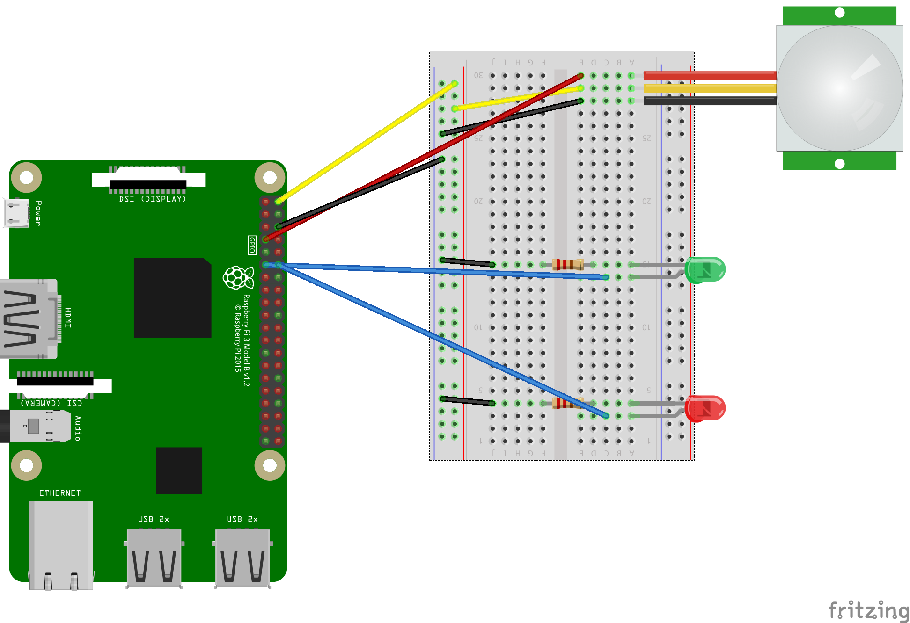

# Motion Detector Example

## About
Example of a motion detector using a PIR sensor, LEDs and Node-Red

## Supported Boards:
Raspberry PI 3+ - ARM64 bit

## Configuration



## Running

### Start EdgeX

On your PC or another computer, use the provided docker-compose.yaml file to launch an EdgeX stack

```
docker-compose -f ./docker-compose.yaml up -d
```

This file also includes Mosquitto MQTT broker and Node Red, both of which are used by this example.

### Configure Node-Red

Now that you have an empty instance of Node Red running in Docker, you will need to add the motion_detector_flow.json


### Run the device service

TODO: Add instructions for adding the Pi's IP address to configuration.toml

TODO: Add instructions for modifying configuration.toml to point to edgex-core-data and edgex-core-metadata

```
device-rpi -c ./examples/MotionDetector
```

### Export device service readings to Node-Red

TODO: Add instructions for modifying registr_mqtt_export.sh to point to edgex-export-client
```
./register_mqtt_export.sh
```


