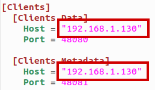
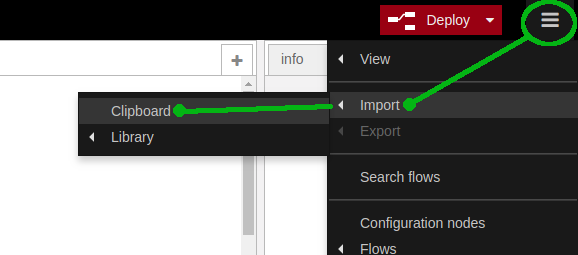
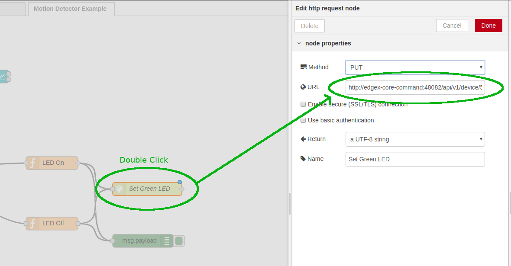
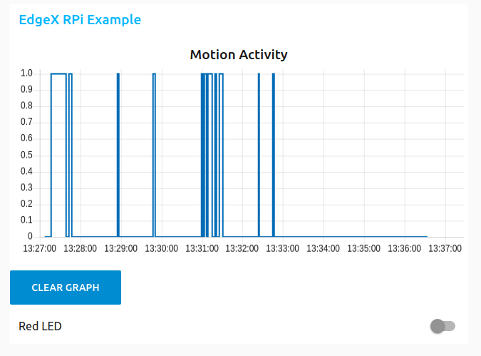

# Motion Detector Example

## About
Example of a motion detector using a PIR sensor, LEDs and Node-Red

## Hardware:
* 1 PIR sensor
* 1 Green LED
* 1 Red LED
* 2 220ohm resisters

## Configuration

Connect the LEDs and PIR sensor as shown below.


* Make sure that the PIR sensor is connected to the 5v pin and not the 3.3v pin on the Raspberry Pi

* The output pin on the PIR should be connected to pin #7 on the Raspberry Pi.

* The Green LED should be connected to pin #11 on the Pi, and the Red LED connected to pin #12

## Running

### Start EdgeX

While you can run EdgeX on a RaspberryPi, due to it's limited resources it's best to run the EdgeX services on your PC or another computer.

Use the docker-compose.yaml file provided in this example project to launch an EdgeX stack

```
docker-compose -f ./examples/MotionDetector/docker-compose.yaml up -d
```

This file also includes Mosquitto MQTT broker and Node Red, both of which are used later in this example.

### Run the device service

Before running `device-rpi` for this example, you will need to change its `configuration.toml` to point to the
IP address of your RaspberryPi as well as the IP address of your running EdgeX services.

At the top of the file, replace the `Host` property with the IP address of your RaspberryPi


In the `[Clients]` section, update the `Host` properties for Data and Metadata with the IP address
of the machine running the EdgeX services you started in the first step.



Then you can start the `device-rpi` service using using the `MotionDetector ` example:
```
./build/release/device-rpi --confdir ./examples/MotionDetector
```

### Configure Node-Red

A Node-Red flow is provided for this example, you will need to load it into your instance.

1. Open http://localhost:1880/ on the the machine running your EdgeX services (or replace `localhost` with that machine's IP address)

2. Import the example Node-Red configuration by copy/pasting the provided `motion_detector_flow.json` file into your instance



Because an EdgeX Device Command has a unique, generated URL, you will need to update your Node-Red flow with the correct URL from your EdgeX instance.

3. Open http://localhost:48082/api/v1/device/name/RPiMotionDetector on the machine running your EdgeX services (or replace `localhost` with that machine's IP address)

4. Find the `url` property for `Set_Green_Led`

5. Copy that URL into the URL field for the `Set Greed LED` node in your Node-Red flow:



6. Repeat steps 4 and 5 for `Set_Red_Led` and the `Set Red LED` node.

7. Click the `Deploy` button at the top of your Node-Red screen to start your flow


### Export device service readings to Node-Red

Finally, you need to tell your EdgeX instance to export data to Node-Red. 
This example uses the Mosquitto MQTT broker to link the two. 

Run the `register_mqtt_export.sh` script on the machine running your EdgeX services (or replace `localhost` at the end of that script with that machine's IP address)

```
./register_mqtt_export.sh
```

## Testing

You will now have a Node-Red dashboard at http://localhost:1880/ui/ where you can watch motion events come in, and control the Red LED on your board.




